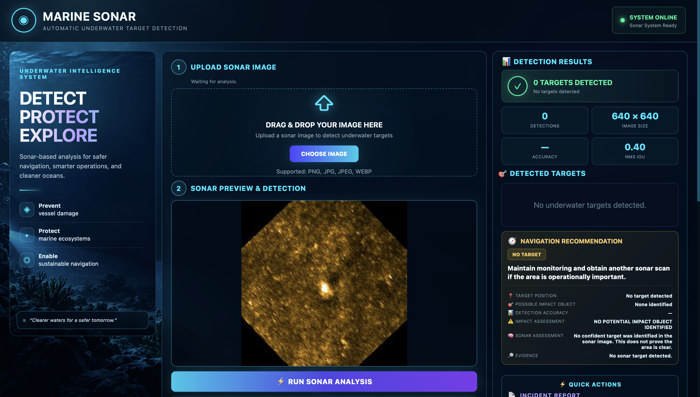

# 🌊 Marine Sonar AI

### AI-Powered Underwater Target Detection & Mission Analysis
 
Marine Sonar AI is a computer-vision web application for analyzing underwater sonar imagery. It uses a YOLO-based detection model to identify marine targets and presents the results through an interactive mission dashboard.



---

## 🚀 What the Project Does

**Upload sonar image → Run AI detection → Analyze targets → Track scans → Generate report**

The application is designed to make underwater sonar analysis easier to inspect, interpret, and document.

### Core capabilities

- 🔎 **Sonar image detection** using YOLO
- 🎯 **Marine target classification** and confidence reporting
- 🔄 **Multi-scan target tracking**
- 📊 **Mission statistics and detection history**
- 🗺️ **Mission-map visualization**
- 📄 **PDF incident / mission reports**
- ⚡ **FastAPI backend + web frontend**
- 🌊 Mission-oriented underwater UI

---

## 🧠 AI Detection

The current primary model is:

```text
models/drishti.pt
```

The DRISHTI model used by the application contains these classes:

| ID | Target |
|---:|---|
| 0 | Crab pot |
| 1 | Submarine pipeline |
| 2 | Shipwreck |
| 3 | Ghost net |
| 4 | Mine cylinder |

The model output is used by the backend to produce detection results for the frontend.

---

## 🖥️ Application Flow

```text
┌──────────────────┐
│  Sonar Image     │
│     Upload       │
└────────┬─────────┘
         │
         ▼
┌──────────────────┐
│   FastAPI API    │
│  /api/detect     │
└────────┬─────────┘
         │
         ▼
┌──────────────────┐
│   YOLO Model     │
│  DRISHTI Model   │
└────────┬─────────┘
         │
         ▼
┌──────────────────┐
│ Detection Results│
│ + Confidence     │
└────────┬─────────┘
         │
     ┌───┴──────────────┐
     ▼                  ▼
┌─────────────┐   ┌──────────────┐
│ Multi-Scan  │   │ PDF Mission  │
│ Tracking    │   │ Report       │
└─────────────┘   └──────────────┘
```

---

## ✨ Main Dashboard

The dashboard is organized around a marine mission workflow:

**1. Upload Sonar Image**  
Select or drag-and-drop a sonar image.

**2. Sonar Preview & Detection**  
Preview the scan and run AI inference.

**3. Detection Results**  
View detected targets, image information, confidence, and IoU-related results.

**4. Navigation Recommendation**  
Display analysis information for the current scan.

**5. Multi-Scan Tracking**  
Compare successive scans and identify persistent, new, or lost targets.

**6. Mission Statistics & Map**  
Review scan statistics and mission visualization.

**7. Incident Report**  
Generate a downloadable PDF report.

---

## 🛠️ Tech Stack

| Layer | Technology |
|---|---|
| Frontend | HTML, CSS, JavaScript |
| Backend | Python, FastAPI |
| Server | Uvicorn |
| AI | Ultralytics YOLO |
| Computer Vision | OpenCV, NumPy |
| ML Runtime | PyTorch |
| Reporting | ReportLab |
| Version Control | Git + GitHub |

---

## 📁 Project Structure

```text
marine-sonar/
│
├── backend/
│   └── main.py
│
├── frontend/
│   └── index.html
│
├── models/
│   └── drishti.pt
│
├── screenshots/
│   └── marine-sonar-dashboard.png
│
├── requirements.txt
├── .gitignore
└── README.md
```

> Additional training, evaluation, and dataset files may exist in the repository but are omitted from this high-level structure for readability.

---

## ⚙️ Run Locally

### 1. Clone

```bash
git clone https://github.com/ruchaakadam/marine-sonar.git
cd marine-sonar
```

### 2. Create a virtual environment

**macOS / Linux**

```bash
python3 -m venv .ml-venv
source .ml-venv/bin/activate
```

**Windows PowerShell**

```powershell
python -m venv .ml-venv
.\.ml-venv\Scripts\Activate.ps1
```

### 3. Install dependencies

```bash
pip install -r requirements.txt
```

### 4. Start the backend

```bash
python -m uvicorn backend.main:app --host 127.0.0.1 --port 8000
```

Backend:

```text
http://127.0.0.1:8000
```

API documentation:

```text
http://127.0.0.1:8000/docs
```

### 5. Start the frontend

Open a second terminal:

```bash
python3 -m http.server 5500 --directory frontend
```

Frontend:

```text
http://127.0.0.1:5500
```

---

## 🔌 API

| Endpoint | Method | Function |
|---|---|---|
| `/api/health` | GET | Backend/model health |
| `/api/detect` | POST | Analyze a sonar image |
| `/api/track` | POST | Multi-scan tracking |
| `/api/report` | POST | Generate mission report |

---

## 🔬 Detection Workflow

```text
SONAR IMAGE
     ↓
UPLOAD
     ↓
YOLO INFERENCE
     ↓
TARGET DETECTION
     ↓
CONFIDENCE / RESULT ANALYSIS
     ↓
MULTI-SCAN TRACKING
     ↓
MISSION REPORT
```

---

## 🌐 Deployment

The project uses a separate frontend and FastAPI backend architecture.

The codebase is maintained with Git/GitHub, and the backend has been configured for cloud deployment.

For development and testing, the local setup above runs the frontend and backend independently.

---

## 🎓 Project Goal

Marine Sonar AI demonstrates how computer vision can assist underwater exploration by automatically analyzing sonar imagery and organizing the results into a mission-oriented workflow.

The project focuses on combining **AI detection, visualization, tracking, and reporting** in a single application.

---

## 🔮 Future Scope

- Real-time sonar-stream analysis
- Larger marine-specific training datasets
- Additional underwater target classes
- Improved multi-object tracking
- ROV / autonomous underwater vehicle integration
- Historical mission comparison
- Geographic mission history
- Model optimization for low-resource environments

---

## 👥 Project

**Marine Sonar AI — AI4Shipwrecks**

Built as an AI/computer-vision project for underwater sonar analysis.
